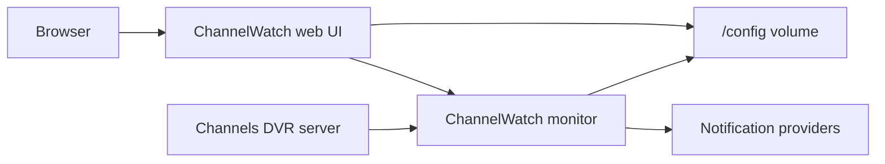

# ChannelWatch

[](https://opensource.org/licenses/MIT)
[](https://hub.docker.com/r/coderluii/channelwatch)
[](https://hub.docker.com/r/coderluii/channelwatch)
[](https://github.com/CoderLuii/ChannelWatch/releases)
[](https://github.com/CoderLuii/ChannelWatch/issues)
[](https://github.com/CoderLuii/ChannelWatch/discussions)
[](https://www.paypal.com/donate/?hosted_button_id=PM2UXGVSTHDNL)
[](https://buymeacoffee.com/CoderLuii)
[](https://x.com/CoderLuii)

ChannelWatch is a self-hosted Channels DVR monitor that watches DVR activity, shows it in a web UI, and sends notifications when something worth knowing happens.

> Disclaimer: ChannelWatch is an independent community tool. It is not affiliated with, endorsed by, or sponsored by Fancy Bits LLC or Channels DVR. "Channels DVR" is a product of Fancy Bits LLC. Channel logos displayed in notifications belong to their respective owners and are shown for identification purposes only.

## Contents

- [Why ChannelWatch Exists](#why-channelwatch-exists)
- [What It Watches](#what-it-watches)
- [Quick Start](#quick-start)
- [Configuration Model](#configuration-model)
- [Notification Providers](#notification-providers)
- [Multi-DVR Support](#multi-dvr-support)
- [Security And Data](#security-and-data)
- [Deployment Options](#deployment-options)
- [Troubleshooting](#troubleshooting)
- [Project Layout](#project-layout)
- [Support](#support)
- [License](#license)

## Why ChannelWatch Exists

Channels DVR already does the hard work of recording and serving TV. ChannelWatch sits beside it and answers the questions that matter when you are running the DVR yourself:

- What is being watched right now?
- Which device started the stream?
- Did a recording start, finish, stop, or fail?
- Is the DVR storage getting low?
- Did a notification send, fail, retry, or get rate limited?
- Is every DVR in a multi-server setup still reachable?

The goal is simple: make the container easy to run, then let the web UI handle the application setup.



## What It Watches

- Live TV viewing sessions, including channel, program, device, stream source, and active stream count.
- VOD and recorded-content playback, including title, progress, rating, genres, cast, and device details.
- Recording lifecycle events such as scheduled, started, completed, cancelled, and stopped.
- DVR disk usage with warning and critical thresholds.
- Per-DVR status, history, notification routing, and cached version metadata.
- Notification delivery history, retries, circuit-breaker state, and rate limiting.
- Health, readiness, startup, metrics, backup, restore, and debug-bundle surfaces.
- In-app problem reports from Diagnostics, including sanitized report previews, optional screenshots, and debug-bundle validation.

ChannelWatch can run without notification providers while you use it as a dashboard, then send alerts later after you configure Pushover, Apprise, Discord, Slack, Telegram, email, Gotify, Matrix, webhook receivers, or another Apprise-supported destination.

## Quick Start

Create `docker-compose.yml`:

```yaml
services:
  channelwatch:
    image: coderluii/channelwatch:latest
    container_name: channelwatch
    network_mode: host
    volumes:
      - /mnt/user/appdata/channelwatch:/config
    environment:
      TZ: America/Los_Angeles
      CHANNELWATCH_SECRET_STORAGE_KEY: "${CHANNELWATCH_SECRET_STORAGE_KEY:?set a unique value of at least 32 characters}"
      PUID: "99"
      PGID: "100"
    restart: unless-stopped
```

Start it:

```bash
docker compose up -d
```

Open the web UI:

```text
http://your-server-ip:8501
```

On a new install, ChannelWatch opens a first-run setup flow where you choose secure login or trusted-network no-auth mode, then add your Channels DVR server.

For bridge networking, replace `network_mode: host` with:

```yaml
ports:
  - "8501:8501"
```

## Configuration Model

Docker Compose should handle container concerns:

- image tag
- network mode or port mapping
- `/config` volume
- timezone
- `PUID` and `PGID`
- restart policy

The web UI should handle ChannelWatch concerns:

- first-run auth setup
- DVR servers
- alert options
- notification providers
- notification routing
- backup and restore
- security mode and account changes

Useful startup variables:

| Variable | Purpose |
| --- | --- |
| `TZ` | Timezone used for timestamps, for example `America/Los_Angeles`. |
| `PUID` / `PGID` | Container file ownership for `/config`, useful on Unraid and NAS installs. |
| `CHANNELWATCH_SECRET_STORAGE_KEY` | Required for new local secret-key writes. Set this to a unique value of at least 32 characters and keep it with your deployment secrets. |
| `CHANNELS_DVR_SERVERS` | Optional bootstrap list for multiple DVRs, for example `Home@192.168.1.10:8089,Garage@192.168.1.11:8089`. |
| `CHANNELS_DVR_HOST` / `CHANNELS_DVR_PORT` | Legacy single-DVR bootstrap variables. They still work, but multi-DVR setup through the UI or `CHANNELS_DVR_SERVERS` is preferred. |
| `CW_DISABLE_AUTH` | Temporary break-glass override. Do not use it as the normal auth model. |

Full environment reference: [`docs/reference/env-vars.md`](docs/reference/env-vars.md).

## Notification Providers

ChannelWatch sends notifications through Apprise and built-in provider plumbing:

| Provider | Notes |
| --- | --- |
| Pushover | Simple mobile and desktop push notifications. |
| Discord, Slack, Telegram, Matrix, Gotify, Email | Supported through Apprise URLs and provider settings. |
| Webhooks | Signed outbound HTTP payloads for custom receivers and automations. |
| Plugins | Optional provider plugins loaded from documented plugin locations. |

Private LAN notification receivers stay blocked by default until you approve
the exact destination in **Settings > Notifications**. This trusted-local flow
is available for native webhooks and HTTP-style custom Apprise URLs such as
`json://`, `form://`, and `xml://`. Image fetching and metadata, link-local,
loopback, reserved, malformed, or unresolved destinations remain blocked.

Useful references:

- [`docs/reference/apprise-providers.md`](docs/reference/apprise-providers.md)
- [`docs/reference/webhook.md`](docs/reference/webhook.md)
- [`docs/reference/plugins.md`](docs/reference/plugins.md)
- [`docs/reference/templates.md`](docs/reference/templates.md)

## Multi-DVR Support

ChannelWatch v0.9 adds multi-DVR monitoring with per-DVR identity, status, activity history, notification routing, and soft-delete behavior.

Common setup paths:

- Add DVRs in the first-run wizard or Settings page.
- Bootstrap multiple DVRs with `CHANNELS_DVR_SERVERS`.
- Keep older `CHANNELS_DVR_HOST` and `CHANNELS_DVR_PORT` installs running while you move DVR setup into the web UI.

Guides:

- [`docs/how-to/multi-dvr.md`](docs/how-to/multi-dvr.md)
- [`docs/reference/multi-dvr.md`](docs/reference/multi-dvr.md)

## Security And Data

ChannelWatch stores its runtime state under `/config`. Back up that volume before upgrades and protect it like other home-server application data.

Security behavior in v0.9:

- Fresh installs use setup-first auth.
- Session login uses CSRF protection for state-changing browser requests.
- Legacy API-key compatibility remains for older installs and automation paths.
- Sensitive settings are masked in browser API responses.
- Webhook secrets are masked and should be rotated if exposed.
- New local secret-key writes use envelope encryption with `CHANNELWATCH_SECRET_STORAGE_KEY`.
- Debug bundles are sanitized before download.
- ChannelWatch does not include a phone-home telemetry client by default.

Read more:

- [`docs/project/PRIVACY.md`](docs/project/PRIVACY.md)
- [`.github/SECURITY.md`](.github/SECURITY.md)
- [`docs/how-to/backup-restore.md`](docs/how-to/backup-restore.md)
- [`docs/reference/health-diagnostics.md`](docs/reference/health-diagnostics.md)

## Deployment Options

| Option | Path |
| --- | --- |
| Docker Compose | [`deploy/compose/default.yml`](deploy/compose/default.yml) |
| Unraid template | [`deploy/unraid/channelwatch.xml`](deploy/unraid/channelwatch.xml) |
| Helm chart | [`deploy/helm/channelwatch`](deploy/helm/channelwatch) |
| Docker Hub description | [`docs/dockerhub-description.md`](docs/dockerhub-description.md) |

The Docker image is published for `linux/amd64` and `linux/arm64`. Docker selects the matching platform automatically for normal pulls.

The Helm chart is single-replica by design because ChannelWatch uses writable application state under `/config`.

## Troubleshooting

Start here:

```bash
docker logs -f channelwatch
```

Useful in-container checks:

```bash
docker exec -it channelwatch channelwatch doctor config-check
docker exec -it channelwatch channelwatch doctor diagnose
docker exec -it channelwatch channelwatch doctor reset-admin-password --username <admin>
```

For UI-based diagnostics, open ChannelWatch and use the Diagnostics page. It can test DVR connectivity, API behavior, notification delivery, disk checks, debug-bundle generation, and the in-app **Report a Problem** flow.

The **Report a Problem** option prepares a sanitized support report from inside ChannelWatch. It can include a public issue preview, safe diagnostics, optional contact handles, screenshots, and one ChannelWatch-generated debug bundle ZIP. Private attachments and private contact details are handled separately from the public issue text.

More help:

- [`docs/how-to/troubleshoot-notifications.md`](docs/how-to/troubleshoot-notifications.md)
- [`docs/reference/logs-metrics.md`](docs/reference/logs-metrics.md)
- [`docs/reference/disk-monitoring.md`](docs/reference/disk-monitoring.md)
- [`docs/reference/api.md`](docs/reference/api.md)

## Project Layout

```text
ChannelWatch/
|-- app/                         # Runnable application code
|   |-- bin/                     # Container command-line launcher
|   |-- core/                    # Monitor process, alerts, storage, notifications, and startup
|   `-- ui/                      # Next.js frontend and FastAPI browser API
|-- deploy/                      # Docker, Compose, Helm, Unraid, config, requirements, and QA scripts
|   |-- compose/                 # Compose examples
|   |-- config/                  # Tool configs and supervisor template
|   |-- docker/                  # Dockerfile and Docker build ignore file
|   |-- helm/                    # Helm chart
|   |-- requirements/            # Python dependency manifests
|   |-- scripts/                 # Documentation QA helpers
|   `-- unraid/                  # Maintained Unraid template
|-- docs/                        # User, operator, reference, project, release, and legal docs
|-- .github/                     # GitHub workflows, issue templates, labels, support, and security files
|-- LICENSE
`-- README.md
```

## Support

- In the app, open **Diagnostics > Report a Problem** when you need to send a reproducible support report with sanitized diagnostics.
- [GitHub Discussions](https://github.com/CoderLuii/ChannelWatch/discussions)
- [GitHub Issues](https://github.com/CoderLuii/ChannelWatch/issues)
- [Docker Hub](https://hub.docker.com/r/coderluii/channelwatch)
- [Project roadmap](docs/project/ROADMAP.md)

Project support:

- [GitHub Sponsors](https://github.com/sponsors/CoderLuii)
- [PayPal](https://www.paypal.com/donate/?hosted_button_id=PM2UXGVSTHDNL)
- [Buy Me a Coffee](https://buymeacoffee.com/CoderLuii)
- [X / Twitter](https://x.com/CoderLuii)

## License

ChannelWatch is released under the MIT License. See [`LICENSE`](LICENSE).
