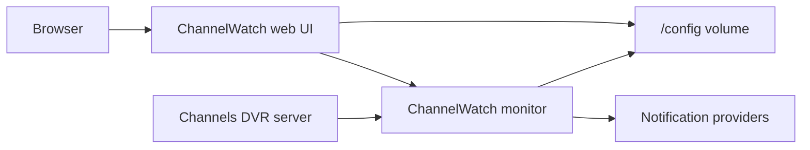

# ChannelWatch

[](https://opensource.org/licenses/MIT)
[](https://hub.docker.com/r/coderluii/channelwatch)
[](https://hub.docker.com/r/coderluii/channelwatch)
[](https://github.com/CoderLuii/ChannelWatch/releases)
[](https://github.com/CoderLuii/ChannelWatch/issues)
[](https://github.com/CoderLuii/ChannelWatch/discussions)
[](https://www.paypal.com/donate/?hosted_button_id=PM2UXGVSTHDNL)
[](https://buymeacoffee.com/CoderLuii)
[](https://x.com/CoderLuii)

ChannelWatch is a self-hosted Channels DVR monitor that watches DVR activity, shows it in a web UI, and sends notifications when something worth knowing happens.

> Disclaimer: ChannelWatch is an independent community tool. It is not affiliated with, endorsed by, or sponsored by Fancy Bits LLC or Channels DVR. "Channels DVR" is a product of Fancy Bits LLC. Channel logos displayed in notifications belong to their respective owners and are shown for identification purposes only.

## Contents

- [Why ChannelWatch Exists](#why-channelwatch-exists)
- [What It Watches](#what-it-watches)
- [Quick Start](#quick-start)
- [Configuration Model](#configuration-model)
- [Notification Providers](#notification-providers)
- [Multi-DVR Support](#multi-dvr-support)
- [Security And Data](#security-and-data)
- [Deployment Options](#deployment-options)
- [Updating ChannelWatch](#updating-channelwatch)
- [Troubleshooting](#troubleshooting)
- [Project Layout](#project-layout)
- [Support](#support)
- [License](#license)

## Why ChannelWatch Exists

Channels DVR already does the hard work of recording and serving TV. ChannelWatch sits beside it and answers the questions that matter when you are running the DVR yourself:

- What is being watched right now?
- Which device started the stream?
- Did a recording start, finish, stop, or fail?
- Is the DVR storage getting low?
- Did a notification send, fail, retry, or get rate limited?
- Is every DVR in a multi-server setup still reachable?

The goal is simple: make the container easy to run, then let the web UI handle the application setup.


```mermaid
flowchart LR
    DVR["Channels DVR server"] --> Core["ChannelWatch monitor"]
    Core --> Config["/config volume"]
    Core --> Notify["Notification providers"]
    Browser["Browser"] --> UI["ChannelWatch web UI"]
    UI --> Config
    UI --> Core
```

## What It Watches

- Live TV viewing sessions, including channel, program, device, stream source, and active stream count.
- VOD and recorded-content playback, including title, progress, rating, genres, cast, and device details.
- Recording lifecycle events such as scheduled, started, completed, cancelled, and stopped.
- DVR disk usage with warning and critical thresholds.
- Per-DVR status, history, notification routing, and cached version metadata.
- Notification delivery history, retries, circuit-breaker state, and rate limiting.
- Health, readiness, startup, metrics, backup, restore, and debug-bundle surfaces.
- In-app problem reports from Diagnostics, including sanitized report previews, optional screenshots, and debug-bundle validation.

ChannelWatch can run without notification providers while you use it as a dashboard, then send alerts later after you configure Pushover, Apprise, Discord, Slack, Telegram, email, Gotify, Matrix, webhook receivers, or another Apprise-supported destination.

## Quick Start

Create `docker-compose.yml`:

```yaml
services:
  channelwatch:
    image: coderluii/channelwatch:latest
    container_name: channelwatch
    network_mode: host
    volumes:
      - /mnt/user/appdata/channelwatch:/config
    environment:
      TZ: America/Los_Angeles
      PUID: "99"
      PGID: "100"
    restart: unless-stopped
```

Start it:

```sh
docker compose up -d
```

Open the web UI:

```text
http://your-server-ip:8501
```

On a new install, ChannelWatch opens a first-run setup flow where you choose secure login or trusted-network no-auth mode, then add your Channels DVR server.

For bridge networking, replace `network_mode: host` with:

```yaml
ports:
  - "8501:8501"
```

## Configuration Model

Docker Compose should handle container concerns:

- image tag
- network mode or port mapping
- `/config` volume
- timezone
- `PUID` and `PGID`
- restart policy

The web UI should handle ChannelWatch concerns:

- first-run auth setup
- DVR servers
- alert options
- notification providers
- notification routing
- backup and restore
- security mode and account changes

Useful startup variables:

| Variable | Purpose |
| --- | --- |
| `TZ` | Timezone used for timestamps, for example `America/Los_Angeles`. |
| `PUID` / `PGID` | Container file ownership for `/config`, useful on Unraid and NAS installs. |
| `CHANNELS_DVR_SERVERS` | Optional bootstrap list for multiple DVRs, for example `Home@192.168.1.10:8089,Garage@192.168.1.11:8089`. |
| `CHANNELS_DVR_HOST` / `CHANNELS_DVR_PORT` | Legacy single-DVR bootstrap variables. They still work, but multi-DVR setup through the UI or `CHANNELS_DVR_SERVERS` is preferred. |
| `CW_DISABLE_AUTH` | Temporary break-glass override. Do not use it as the normal auth model. |

Full environment reference: [`docs/reference/env-vars.md`](docs/reference/env-vars.md).

## Notification Providers

ChannelWatch sends notifications through Apprise and built-in provider plumbing:

| Provider | Notes |
| --- | --- |
| Pushover | Simple mobile and desktop push notifications. |
| Discord, Slack, Telegram, Matrix, Gotify, Email | Supported through Apprise URLs and provider settings. |
| Webhooks | Signed outbound HTTP payloads for custom receivers and automations. |
| Plugins | Optional provider plugins loaded from documented plugin locations. |

Private LAN notification receivers stay blocked by default until you approve
the exact destination in **Settings > Notifications**. This trusted-local flow
is available for native webhooks and HTTP-style custom Apprise URLs such as
`json://`, `form://`, and `xml://`. Image fetching and metadata, link-local,
loopback, reserved, malformed, or unresolved destinations remain blocked.

Useful references:

- [`docs/reference/apprise-providers.md`](docs/reference/apprise-providers.md)
- [`docs/reference/webhook.md`](docs/reference/webhook.md)
- [`docs/reference/plugins.md`](docs/reference/plugins.md)
- [`docs/reference/templates.md`](docs/reference/templates.md)

## Multi-DVR Support

ChannelWatch v0.9 adds multi-DVR monitoring with per-DVR identity, status, activity history, notification routing, and soft-delete behavior.

Common setup paths:

- Add DVRs in the first-run wizard or Settings page.
- Bootstrap multiple DVRs with `CHANNELS_DVR_SERVERS`.
- Keep older `CHANNELS_DVR_HOST` and `CHANNELS_DVR_PORT` installs running while you move DVR setup into the web UI.

Guides:

- [`docs/how-to/multi-dvr.md`](docs/how-to/multi-dvr.md)
- [`docs/reference/multi-dvr.md`](docs/reference/multi-dvr.md)

## Security And Data

ChannelWatch stores its runtime state under `/config`. Back up that volume before upgrades and protect it like other home-server application data.

Security behavior in v0.9:

- Fresh installs use setup-first auth.
- Session login uses CSRF protection for state-changing browser requests.
- Legacy API-key compatibility remains for older installs and automation paths.
- Sensitive settings are masked in browser API responses.
- Webhook secrets are masked and should be rotated if exposed.
- ChannelWatch creates and manages a random encryption key under `/config`; users do not generate or preserve a separate deployment key.
- `/config` and ChannelWatch backup archives contain credential-bearing material and must be protected accordingly.
- Debug bundles are sanitized before download.
- ChannelWatch does not include a phone-home telemetry client by default.

Read more:

- [`docs/project/PRIVACY.md`](docs/project/PRIVACY.md)
- [`.github/SECURITY.md`](.github/SECURITY.md)
- [`docs/how-to/backup-restore.md`](docs/how-to/backup-restore.md)
- [`docs/reference/health-diagnostics.md`](docs/reference/health-diagnostics.md)

## Deployment Options

| Option | Path |
| --- | --- |
| Docker Compose | [`deploy/compose/default.yml`](deploy/compose/default.yml) |
| Unraid template | [`deploy/unraid/channelwatch.xml`](deploy/unraid/channelwatch.xml) |
| Helm chart | [`deploy/helm/channelwatch`](deploy/helm/channelwatch) |
| Docker Hub description | [`docs/dockerhub-description.md`](docs/dockerhub-description.md) |

The Docker image is published for `linux/amd64` and `linux/arm64`. Docker selects the matching platform automatically for normal pulls.

The Helm chart is single-replica by design because ChannelWatch uses writable application state under `/config`. It uses Kubernetes' `Recreate` deployment strategy so an upgrade stops the old `/config` writer before starting its replacement. Chart-managed ConfigMap and Secret changes automatically replace the pod; after changing the contents of a same-name external Secret, run `kubectl rollout restart deployment -l app.kubernetes.io/instance=<release-name>` in the release namespace.

## Updating ChannelWatch

Use `coderluii/channelwatch:1.0.0`, `1.0`, or `latest` for the v1.0 image milestone. Preserve `/config` when recreating the container.

ChannelWatch v1.0.2 is a signed in-app update for the v1.0.0 runtime. Open **Settings > Updates** to install it. A v1.0.0 image running the v1.0.2 app bundle is fully current; no image pull or container recreation is required. Installations already blocked by an abandoned pre-v1.0.2 scheduler lock can pull and recreate with the optional `1.0.2` image once while preserving `/config`.

Open **Settings > Updates** to review the automatic update policy, check the official signed stable channel, apply an update immediately, postpone it, retry a failed attempt, or roll back a compatible app bundle. Automatic compatible updates default to the local 03:00–05:00 maintenance window; notify-only mode is available.

From v1.0.0 forward, every `X.Y.0` release requires its matching container image, and `X.Y.1` through `X.Y.9` install through the signed Update Center. After `X.Y.9`, ChannelWatch advances to `X.(Y+1).0` rather than publishing patch 10.

**Still on v0.9.9 or v0.9.10? Do not use the old in-app bridge for this upgrade.** The immutable published entrypoints in those images cannot safely activate v0.9.18. Preserve the existing `/config` volume and pull/recreate the v0.9.18 image once. v0.9.18 repairs any stale legacy update marker without discarding the preserved configuration, and its improved Update Center becomes the normal path for future compatible releases.

Once v0.9.18 or newer is installed, its setup and legacy-recovery shell can use only the official signed stable recovery channel before normal administrator navigation is available. The narrow recovery action uses same-origin anti-CSRF state and exact typed confirmation; it cannot accept custom feeds, URLs, uploads, signing keys, or downgrades.

The Update Center checks trusted public ChannelWatch release metadata, verifies signed app bundles, creates a pre-update backup, activates the update, restarts ChannelWatch, and keeps rollback available when the previous runtime can be restored. It does not add telemetry.

Some releases still require a normal container image update. ChannelWatch will say **container image update required** when a release changes Python dependencies, base image packages, Supervisor/container behavior, runtime ABI, Helm assumptions, or persistent schema. See [`docs/how-to/update-channelwatch.md`](docs/how-to/update-channelwatch.md) for the full update guide.

## Troubleshooting

### Project One-Click and older deployment-key installs

Fresh v1.0.0 Project One-Click installations do not need a template variable for encryption. ChannelWatch creates its key automatically under the persistent `/config` volume.

If an older v0.9.5–v0.9.17 installation already has a legacy envelope, leave its existing `CHANNELWATCH_SECRET_STORAGE_KEY` or key-file input in place for the first v0.9.18 restart. ChannelWatch preserves the same logical key, converts it atomically to managed local storage, and then stops depending on that variable. v0.9.9 and v0.9.10 still require the one-time image pull described above; their preserved envelopes migrate after v0.9.18 starts.

If the old value is unavailable or incorrect, ChannelWatch does not overwrite the protected data. Sign in and open **Settings > Security** to retry migration after restoring the value, or explicitly reset only the unrecoverable DVR API keys and custom webhook URLs/secrets while preserving other settings and history. The third-party Project One-Click repository is not modified or redistributed by ChannelWatch.

Start here:

```sh
docker logs -f channelwatch
```

Useful in-container checks:

```sh
docker exec -it channelwatch channelwatch doctor config-check
docker exec -it channelwatch channelwatch doctor diagnose
docker exec -it channelwatch channelwatch doctor reset-admin-password --username <admin>
```

For UI-based diagnostics, open ChannelWatch and use the Diagnostics page. It can test DVR connectivity, API behavior, notification delivery, disk checks, debug-bundle generation, and the in-app **Report a Problem** flow.

The **Report a Problem** option prepares a sanitized support report from inside ChannelWatch. It can include a public issue preview, safe diagnostics, optional contact handles, screenshots, and one ChannelWatch-generated debug bundle ZIP. Private attachments and private contact details are handled separately from the public issue text.

The sidebar also includes **Help & Feedback**. Use it to open the same secure problem-report flow, send a lightweight feature/change request without diagnostics, or open the documentation and community help destinations. Feature drafts and optional screenshots stay only in page memory until submission or explicit discard.

Settings > Alerts includes Monitor Only, Important Only, Balanced, and Everything policies. Fresh v1.0.1 installations use Important Only. Upgrades preserve every existing notification and routing choice, and new operational delivery switches remain off until the administrator changes them. Recording failures, skips, missed starts, interruptions, cancellations, and DVR outages are still recorded in activity history even when notification delivery is disabled.

More help:

- [`docs/how-to/troubleshoot-notifications.md`](docs/how-to/troubleshoot-notifications.md)
- [`docs/how-to/manage-alerts.md`](docs/how-to/manage-alerts.md)
- [`docs/how-to/use-help-feedback.md`](docs/how-to/use-help-feedback.md)
- [`docs/reference/logs-metrics.md`](docs/reference/logs-metrics.md)
- [`docs/reference/disk-monitoring.md`](docs/reference/disk-monitoring.md)
- [`docs/reference/api.md`](docs/reference/api.md)

## Project Layout

```text
ChannelWatch/
|-- app/                         # Runnable application code
|   |-- bin/                     # Container command-line launcher
|   |-- core/                    # Monitor process, alerts, storage, notifications, and startup
|   `-- ui/                      # Next.js frontend and FastAPI browser API
|-- deploy/                      # Docker, Compose, Helm, Unraid, config, requirements, and QA scripts
|   |-- compose/                 # Compose examples
|   |-- config/                  # Tool configs and supervisor template
|   |-- docker/                  # Dockerfile and Docker build ignore file
|   |-- helm/                    # Helm chart
|   |-- requirements/            # Python dependency manifests
|   |-- scripts/                 # Documentation QA helpers
|   `-- unraid/                  # Maintained Unraid template
|-- docs/                        # User, operator, reference, project, release, and legal docs
|-- .github/                     # GitHub workflows, issue templates, labels, support, and security files
|-- LICENSE
`-- README.md
```

## Support

- In the app, open **Diagnostics > Report a Problem** when you need to send a reproducible support report with sanitized diagnostics.
- [GitHub Discussions](https://github.com/CoderLuii/ChannelWatch/discussions)
- [GitHub Issues](https://github.com/CoderLuii/ChannelWatch/issues)
- [Docker Hub](https://hub.docker.com/r/coderluii/channelwatch)
- [Project roadmap](docs/project/ROADMAP.md)

Project support:

- [GitHub Sponsors](https://github.com/sponsors/CoderLuii)
- [PayPal](https://www.paypal.com/donate/?hosted_button_id=PM2UXGVSTHDNL)
- [Buy Me a Coffee](https://buymeacoffee.com/CoderLuii)
- [X / Twitter](https://x.com/CoderLuii)

## License

ChannelWatch is released under the MIT License. See [`LICENSE`](LICENSE).
