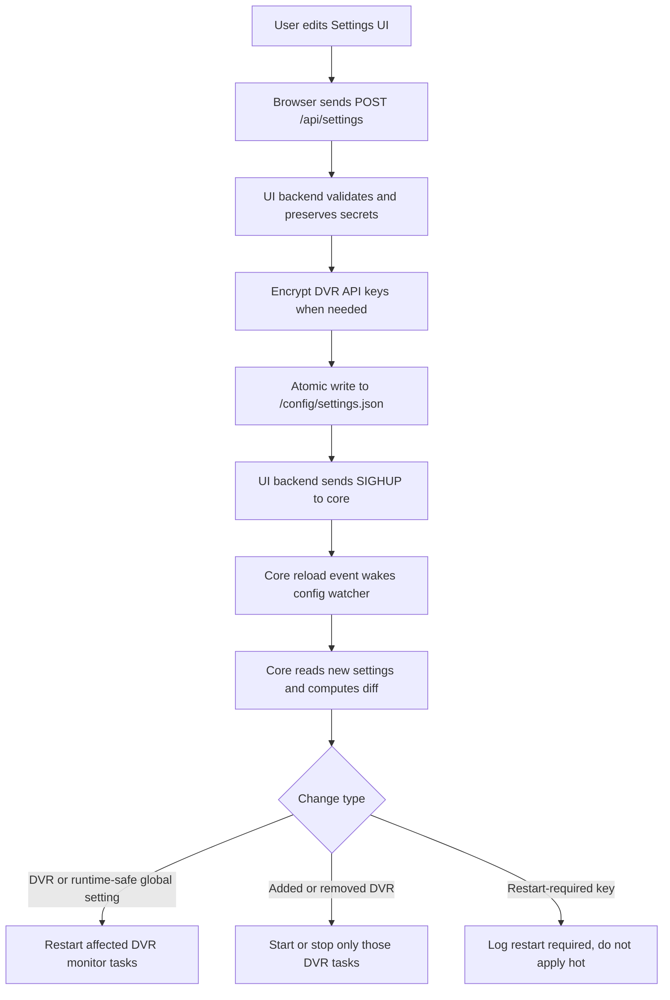

# Configuration lifecycle

ChannelWatch has one persisted settings file and two long-lived readers. The UI backend validates, masks, encrypts, and saves operator changes. The core monitor loads the same file, migrates old schemas, applies process environment overrides, and owns the running DVR monitor tasks.

This split matters because the file is shared, but memory is not. A setting saved in the browser is durable as soon as the UI backend writes `/config/settings.json`, but the core only applies runtime-safe parts after it receives a reload signal and compares the new file with the previous snapshot.

See also:

* [`settings.json` reference](../reference/settings.md)
* [Environment variables reference](../reference/env-vars.md)
* [Two-process model](two-process-model.md)

## The durable file

Saved application settings live at `/config/settings.json` by default. Both processes can use a different directory when `CONFIG_PATH` is set, but the container convention and user-facing docs treat `/config/settings.json` as the durable source.

The file is JSON, not a live database. Each save writes the full settings object, not a patch. That keeps the read path simple, and it also means concurrent writers resolve by the last completed atomic replacement. The UI is the normal writer after startup. The core writes the file when it migrates schema versions, fills new default keys, or encrypts DVR API keys during migration.

## Precedence layers

The practical order is:

1. Built-in defaults from the core and UI schemas.
2. Values loaded from `/config/settings.json`.
3. Schema migration and default filling, owned by the core startup and reload path.
4. Environment overrides that the core applies after file load.
5. Runtime UI changes, which become new file values after `POST /api/settings` saves them.

There is one important nuance: UI changes are persisted, but environment overrides can still win inside the core process after the next reload. For example, the core applies `TZ`, `CHANNELS_DVR_SERVERS`, and the deprecated `CHANNELS_DVR_HOST` plus `CHANNELS_DVR_PORT` after it loads and migrates the file. The UI backend reads the file directly and does not apply those core-only overrides when it builds the settings response.

Some environment variables seed the first settings file at container startup. Those bootstrap values are different from core reload overrides. After `settings.json` exists, the persisted file usually wins for bootstrap-only values, while the core still reapplies the small set of runtime environment overrides it knows about.

## Startup load and migration

At core startup, ChannelWatch creates or loads `/config/encryption.key`, then loads settings. If `settings.json` is missing, defaults are used until a DVR is configured. If the file exists but is invalid JSON or not a JSON object, startup fails closed instead of silently replacing user settings with defaults.

The core migration layer owns schema versioning. The current schema version is `7`. During the v0.9 upgrade, the v6 to v7 migration:

* enables the multi-DVR v2 flag by default,
* canonicalizes DVR IDs from host and port,
* can build a server entry from deprecated single-DVR environment variables when no server exists,
* moves legacy shared session state toward per-DVR session state,
* encrypts DVR API keys before persisting migrated settings.

Before changing an existing settings file, migration creates a backup under `/config/backups/` and records progress in `/config/migration.journal`. The journal lets startup recover from an interrupted migration by restoring the backup or resuming safely.

The UI backend also has a schema model, but it does not own the v7 migration pipeline. On save, it preserves an existing `_version` value when present. If it creates a new file on its own, it writes its own current version marker, and the core brings the file up to the supported core schema on its next load.

## Saving from the UI

The browser sends the full settings payload to `POST /api/settings`. The backend then:

1. reloads the current file,
2. preserves masked or blank sensitive fields from the existing settings,
3. preserves masked DVR API keys by matching server IDs,
4. generates feed tokens when a feed is enabled without a token,
5. encrypts plaintext DVR API keys with `/config/encryption.key`,
6. writes `/config/settings.json` using an atomic file replacement,
7. sends `SIGHUP` to the core process through supervisor process lookup.

Atomic writes matter because the core watcher may read the file soon after the save. The writer serializes JSON to a temporary file, flushes and fsyncs it, replaces the destination, then fsyncs the directory. Readers see either the old complete file or the new complete file, not a partial write.

## Core hot reload

The UI backend does not restart the core for ordinary settings saves. It asks supervisor for the core process ID and sends `SIGHUP`. The core installs a guarded reload path: early in import it ignores `SIGHUP` so a reload signal cannot kill the process before the async runtime is ready. Later, the async runtime replaces that guard with a handler that sets a reload event.

The core watcher also polls the settings file. When the reload event fires, or when the poll sees a changed file hash, the core reads the new JSON, compares it with the previous raw settings snapshot, and classifies the change.

For DVR-specific changes, the diff looks at active DVR entries and restarts only changed DVR monitor tasks. Added DVRs are started. Removed DVRs are stopped. For runtime-safe global changes, all active DVR tasks are restarted so they receive the refreshed shared settings. Version-only changes do not trigger runtime work.

## What reloads and what requires restart

Hot reload is designed for settings that can be applied by rebuilding DVR monitor tasks inside the core process. Examples include DVR host, port, name, enabled state, per-DVR overrides, and non-restart-required global settings that monitor tasks read during initialization.

Some settings are detected but not applied hot. The core logs these as requiring a container or process restart:

* UI listen host,
* UI listen port,
* database URL,
* RBAC feature flag,
* multi-DVR v2 feature flag.

The exact field-by-field behavior is listed in the [`settings.json` reference](../reference/settings.md). When in doubt, use the Settings UI save result for persistence, then restart the affected process or container for fields marked as restart-required.

## Encryption key handling

DVR API keys are stored encrypted when the settings writer or migration path sees plaintext values. ChannelWatch stores the raw encryption key in `/config/encryption.key`, with mode `0600`. If the key is missing, startup creates it. If permissions are too broad, encryption refuses to use it.

Reads are forgiving. If a DVR API key is encrypted but the key file cannot be read or decryption fails, the value is left unchanged rather than being corrupted. Saves are stricter because writing a plaintext API key without a safe key would weaken the stored config.

Back up `/config/encryption.key` with the rest of `/config`. Without that key, existing encrypted DVR API keys cannot be decrypted after a restore.

## Conflict resolution between the two processes

The shared file is the handoff point. The UI backend owns user-facing writes. The core owns migration writes and the in-memory monitor lifecycle. Both use atomic JSON replacement for writes, which protects against torn files but does not merge two simultaneous full-file saves.

If the UI saves a setting that conflicts with a core environment override, the file keeps the UI value and the core process uses the environment value after reload. This can make the UI display differ from core behavior for those override-backed fields. Remove the environment variable and restart or reload the core if you want the saved file value to become the core value.

If a migration and a UI save race, the last completed atomic replacement is the file that remains. In normal operation, migration happens during core startup or reload before operators are actively editing settings, so the Settings UI remains the expected writer during day-to-day use.
