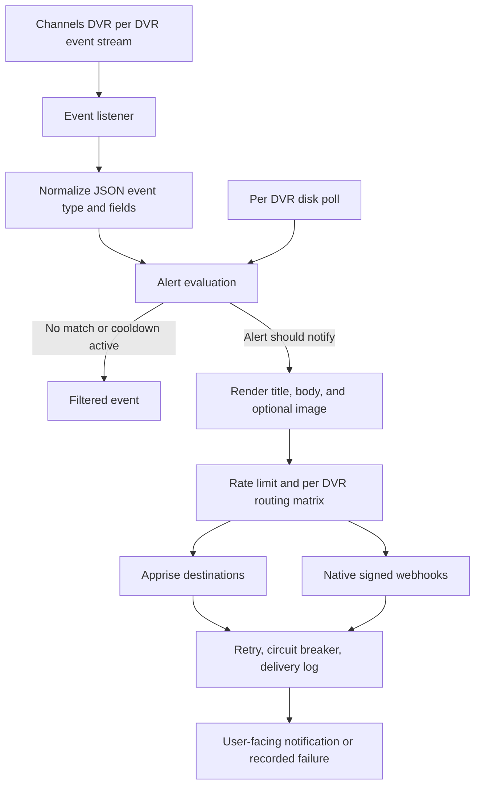

# Notification pipeline

ChannelWatch turns Channels DVR activity into notifications by keeping the monitoring path close to each DVR. Each enabled DVR gets its own event listener, alert state, disk monitor, routing context, and delivery protection. That shape matters because a living room DVR and a basement DVR can produce the same kind of alert, but users may want those alerts to go to different places.

This page explains how an event becomes a user-facing message. For template fields, see [docs/reference/templates.md](../reference/templates.md). For signed outbound webhook payloads, see [docs/reference/webhook.md](../reference/webhook.md). For destination setup and routing keys, see [docs/reference/apprise-providers.md](../reference/apprise-providers.md). For the larger two-process design, see [docs/explanation/architecture.md](./architecture.md).

## Pipeline at a glance

## Per DVR event ingestion

For live event traffic, ChannelWatch opens a server sent events connection to each configured Channels DVR at its DVR event subscription endpoint. The listener expects JSON lines from Channels DVR, strips the SSE `data:` prefix when it appears, and ignores the `hello` handshake event. Every parsed event is passed forward with its Channels DVR `Type`, `Name`, and `Value` fields intact.

The listener also polls the DVR status endpoint as a keep-alive. That poll is used to mark the DVR connection as fresh and online, not to create viewing notifications. Disk space is the exception: it has its own per-DVR disk poll against DVR storage information because disk capacity is state, not an activity stream event.

Keeping ingestion per DVR gives each monitor its own connection status, last seen time, state file, and alert instances. If one DVR disconnects, its alerts pause and reconnect with backoff without merging state with another DVR.

## Event normalization and alert evaluation

ChannelWatch does not convert DVR events into a broad public event schema before alert evaluation. Instead, it normalizes just enough to make routing and filtering reliable: the raw Channels DVR event type is read from `Type`, the session or job identity usually comes from `Name`, and the activity text comes from `Value`.

Each enabled alert family decides whether that normalized event matters:

| Alert family | Input it cares about | When it can notify |
| --- | --- | --- |
| Live TV watching | `activities.set` events whose value describes watching a channel | A new channel viewing session, or a channel change that passes the cooldown and session checks. |
| DVR playback | `activities.set` events for file playback sessions | A new or meaningful playback session update, with metadata looked up for the file. |
| Recording events | Recording job and program events from the DVR stream, plus retry checks for pending job details | Scheduled, started, completed, cancelled, stopped, or failed recording states when that state is enabled. |
| Disk space | Periodic DVR storage poll, not the SSE stream | Warning or critical disk severity, a severity increase, or meaningful worsening after cooldown. |

Alert evaluation is intentionally conservative. Session managers remember active sessions and recent notifications so repeated DVR activity updates do not become repeated phone alerts. Recording alerts keep pending state because some DVR events arrive before all job details are available. Disk alerts compare current severity with the previous and last notified severity so users get notified when storage crosses a worse threshold, not on every poll.

## Rendering the notification text

Once an alert decides to notify, it builds a human message from the data it has gathered. Live TV alerts may include channel, program, client, stream source, stream count, and artwork. DVR playback alerts may include title, episode, progress, device, summary, ratings, cast, and artwork. Recording alerts format lifecycle details such as status, channel, scheduled time, duration, and artwork. Disk alerts format free space, total space, used space, path, and severity.

If the user has kept defaults enabled, ChannelWatch sends the built-in title and body. If custom templates are enabled, the same alert context is passed through the template renderer. Empty output, unknown placeholders, invalid syntax, or unsupported formatting fall back to the default message instead of dropping the alert. That keeps custom templates safe: a bad template changes formatting, but it does not stop the alert from being delivered.

## Deduplication, cooldowns, and rate limiting

Deduplication happens before provider delivery. Live TV, DVR playback, and recording alerts use session keys and notification history to suppress repeated activity updates inside their configured cooldown windows. DVR playback can bypass that rule for meaningful progress changes when the configured threshold says the update is important enough. Disk space uses severity state, worsening checks, and a cooldown so storage alerts are repeated only when the situation changes or keeps getting worse.

After an alert reaches the notification layer, a global notification rate limit is checked. That final guard protects users from bursts across alert types and providers. If the rate limit rejects the notification, no provider delivery is attempted.

## Severity and routing

Severity currently affects disk alert content and behavior. Disk notifications are labeled warning or critical based on the configured free space thresholds. A move from warning to critical sends a new notification even if a previous warning was recent, because the severity has worsened.

Routing is based on two pieces of context attached to every alert: the DVR id and the alert route type. The route types used by the current alert families are `channel`, `vod`, `recording`, and `disk`. ChannelWatch reads the per-DVR routing matrix from settings and decides which destination keys are allowed for that DVR and alert type.

When a DVR or alert type has no routing entry, ChannelWatch treats every destination as enabled. When a route exists, each Apprise destination key and the native `webhook` key can be turned on or off separately. This means one DVR can send disk alerts to email and webhooks, while another DVR sends the same kind of alert only to Pushover.

## Provider dispatch

The provider stage fans out to two delivery paths.

Apprise delivery covers Pushover, Discord, email, Telegram, Slack, Gotify, Matrix, and a custom Apprise URL. The routing matrix is applied before Apprise receives the message, so disabled destination keys are filtered out. Discord has a direct embed path when available, with a fallback through Apprise. Other Apprise destinations are sent as one grouped delivery through the Apprise library.

Native webhooks are separate from Apprise. When webhook routing is enabled, ChannelWatch builds a compact JSON envelope containing the derived webhook event type, timestamp, app identity, version, delivery id, DVR id, DVR name, title, message, and optional image URL. Each enabled endpoint receives the same payload with ChannelWatch signature headers. Webhook event names are derived from the rendered notification title, message, and image presence, so they describe the outgoing notification rather than the raw DVR stream event.

## Retry, circuit breaker, and delivery log

Apprise provider calls are wrapped by delivery tracking. High-frequency live TV and DVR playback alerts use a single outer Apprise attempt so provider rate limits do not stall the DVR event stream. Lower-frequency recording and disk alerts retry failed Apprise attempts after 2, 4, 8, 16, and 32 seconds. Native webhooks have their own short HTTP retry loop for each endpoint, while the outer delivery tracker records the webhook result without adding another retry series.

Delivery protection is per DVR and delivery channel. After five failures for the same DVR and channel, the circuit opens for five minutes. While open, ChannelWatch skips that delivery path and records the skip rather than repeatedly calling a failing provider. A later successful delivery resets the failure count.

When the delivery database is available, each attempt or outcome is persisted to the notification delivery log. The stored record includes DVR id, alert route type, delivery channel, provider type, destination id when available, status, retry count, payload size, any error message, and an optional activity event id. The log records sent, retry, failed, and circuit open outcomes, which makes delivery history useful for troubleshooting without relying only on runtime logs.

## Why the pipeline is split this way

The pipeline separates alert decisions from delivery decisions. Alerts answer, "Is this DVR activity meaningful enough to tell the user?" The notification layer answers, "Where should this already meaningful alert go, and how do we protect delivery?" That split lets templates, routing, retries, circuit breakers, and delivery logs apply consistently across live TV, DVR playback, recording, and disk alerts.

It also explains why per-DVR context is carried all the way to delivery. The same alert type can mean different urgency for different DVRs, and the same provider can be healthy for one DVR path while another path is paused by its circuit breaker. ChannelWatch keeps those decisions local so notification behavior follows the user's DVR layout instead of treating the whole install as one stream.
