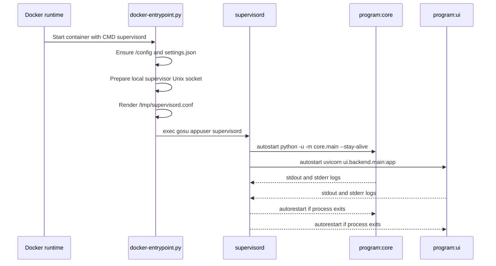

# Two-process model

ChannelWatch runs two long-lived programs in one Docker container because the monitoring loop and the web API have different jobs, different failure modes, and different restart needs. The container is still the deployable unit users run, but inside it `supervisord` keeps the monitoring core and the FastAPI UI backend separate.

## The short version

The core process listens to Channels DVR events, builds alert state, writes activity, and sends notifications. The UI backend serves the static web app, exposes `/api/*`, reads and writes settings, reports health, and sends restart or reload requests to the core.

Those jobs share persisted state under `/config`, but they don't share one Python event loop or one HTTP server. That boundary keeps a busy browser session, a slow API request, or a UI bug from directly stopping DVR event consumption.

## Where the split came from

v0.7 was not monolithic at the container level. The frozen v0.7 supervisor config already started two programs:

* `core`, running `python -u -m core.main --stay-alive`.
* `ui`, running a uvicorn FastAPI server.

The older core was more monolithic inside its own process. It used a single DVR host and port, initialized one event monitor, then called `event_monitor.start_monitoring()`. Settings changes saved by the UI generally required a restart before the core picked them up.

The current design keeps the two-process container model and makes it more deliberate. `deploy/config/supervisor/supervisord.conf.template` still defines `[program:core]` and `[program:ui]`, but the entrypoint now prepares a local supervisor Unix socket, writes the final config to `/tmp/supervisord.conf`, and launches supervisor as PID 1 through the image `CMD`. The current core can run one monitor per enabled DVR and can react to selected config changes through a `SIGHUP` reload path.

## What supervisord actually starts

The shipped template defines these programs:

| Program | Command | Purpose |
|---|---|---|
| `core` | `python -u -m core.main --stay-alive` | Runs the DVR monitoring and notification engine. |
| `ui` | `uvicorn ui.backend.main:app --host 0.0.0.0 --port 8501 --log-level warning` | Serves the FastAPI API and the static exported Next UI. |

Both programs use `directory=/app`, set `PYTHONPATH=/app`, write stdout and stderr to the container logs, and have `autostart=true` and `autorestart=true`.

That restart setting matters. With `autorestart=true`, supervisor restarts either child if it exits after reaching the running state, regardless of whether the exit code looks clean or failed. The template does not define custom `exitcodes`, `startretries`, or a group rule that shuts down the whole container when one child dies. The result is process-level recovery first: a failed core can restart without taking down the UI, and a failed UI can restart without stopping the event monitor.

## Boot flow

## Why not one Python process?

A single process would look simpler, but it would mix two very different lifecycles.

The core is long-running event infrastructure. It connects to DVR event streams, maintains per-DVR monitor tasks, starts poll-based disk checks, persists watchdog snapshots, and sends notifications. It should keep running even if nobody has the web UI open.

The UI backend is request and control infrastructure. It answers health checks, serves static files, handles settings forms, masks secrets, exposes metrics, reads activity history, and asks supervisor or the core to reload. It has user-facing latency and security concerns that are separate from the event-consumer loop.

Putting both roles in one process would make every UI crash, memory leak, blocking request, or import-time failure a direct risk to alert delivery. It would also make restarts coarse. Restarting the API to fix an HTTP issue would stop monitoring, and restarting monitoring to apply a core-only change would drop the UI at the same time.

## Why not separate containers or microservices?

ChannelWatch also avoids a fully decomposed microservice model. A separate core container, API container, worker queue, database service, and message broker would add deployment burden for a self-hosted monitoring app that users expect to run with one compose service and one `/config` volume.

The rejected microservice direction would need service discovery, container-to-container auth, queue or socket contracts, extra health checks, more backup rules, and clearer upgrade ordering. That complexity would not match the current product shape. ChannelWatch needs reliable home-lab deployment more than independent horizontal scaling.

The chosen model is a middle path: one container for simple installs, two supervised processes for separation and recovery.

## How the two processes communicate

ChannelWatch does not use an internal message broker, socket protocol, or queue between the core and UI backend for normal application data.

The shared contract is persisted files under `/config`:

* `settings.json` is the source of truth for settings. The UI writes it, and the core reads it during startup and selected reload paths.
* `channelwatch.db` is the SQLite store used by newer activity and auth paths when present.
* `activity_history.json` remains a fallback and compatibility path for activity history reads.
* `channelwatch.log` and watchdog state files give the UI diagnostics and status context.

There is one control channel: the UI backend talks to supervisor through a local Unix socket under the ChannelWatch runtime directory. It uses that to inspect the `core` process, restart it, shut down supervisor for container restart, or find the core PID and send `SIGHUP` for hot reload.

That means the IPC model is intentionally conservative. Configuration and history are durable files. Runtime control goes through supervisor. There is no hidden in-memory bus that users need to back up or debug.

## Failure isolation and restart semantics

The split improves reliability in ordinary failure cases:

* If the core crashes after startup, supervisor restarts `program:core`. The UI can still answer health and diagnostics while that happens.
* If the UI backend crashes, supervisor restarts `program:ui`. The core can keep consuming DVR events and sending notifications.
* If settings change, the UI saves `/config/settings.json` and tries to signal the core. The core compares the new file with the prior raw settings and restarts affected DVR monitor tasks when the change is hot-reloadable.
* If the whole container needs to restart, the UI asks supervisor to shut down, falling back to signaling PID 1.

This is not full fault containment. Both programs still share one filesystem, one memory limit, one image, one network namespace, and one container health check. The UI health endpoint is the Docker health check, so a broken UI can mark the container unhealthy even if the core is still working. That is an acceptable trade-off for a single-service install.

## Trade-offs

The model costs more than a single process. It loads Python twice, keeps two runtimes resident, and needs supervisor configuration plus a local control socket. It also creates schema-drift risk because the core and UI each have config readers that must agree on `/config/settings.json`.

The benefit is operational clarity. The core can focus on DVR event handling and alert delivery. The UI can focus on API, auth, diagnostics, and static asset serving. Restart actions are narrower, logs show which program emitted output, and supervisor gives a simple recovery loop without asking users to operate several services.

For ChannelWatch, that trade is the point: one container for users, two processes for reliability.
